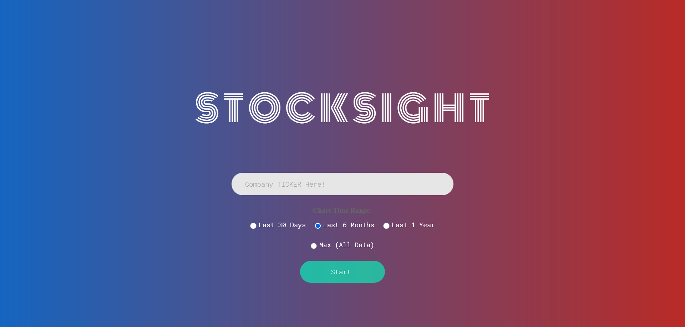

# Stock Sight - Stock Price Forecasting System

A modern Flask-based web application that predicts next-day stock prices using Facebook's Prophet time series forecasting algorithm. The application provides real-time stock market predictions with interactive visualizations and accuracy metrics.



## 🚀 Features

- **Next-Day Price Prediction**: Forecasts the next trading day's closing price for any US stock
- **Interactive Charts**: Visualize historical prices, forecast trends, and uncertainty intervals
- **Multiple Time Ranges**: View data across different periods (30 days, 6 months, 1 year, or all data)
- **Accuracy Metrics**: See model performance with MAPE, R² score, and accuracy percentage
- **Real-Time Data**: Fetches latest stock data via Yahoo Finance API
- **Modern UI**: Single-page dashboard with clean, responsive design
- **Company Information**: Displays sector, country, website, and business summary

## 📋 Prerequisites

- **Python 3.8.10** (recommended for best compatibility)
- **pip** (Python package manager)
- **Virtual environment** (recommended)

## 🛠️ Installation

### Step 1: Clone the Repository

### Step 2: Create Virtual Environment
```bash
# Windows
py -3.8 -m venv .venv
.\.venv\Scripts\Activate.ps1

# macOS/Linux
python3.8 -m venv .venv
source .venv/bin/activate
```

### Step 3: Upgrade pip
```bash
python -m pip install --upgrade pip setuptools wheel
```

### Step 4: Install Dependencies
```bash
pip install -r REQUIREMENTS.txt
```

### Step 5: Run the Application
```bash
python runserver.py
```

Navigate to `http://localhost:5555` in your browser.

## 📦 Technology Stack

| Package | Version | Purpose |
|---------|---------|---------|
| **Python** | 3.8.10 | Core language |
| **Flask** | 2.3.2 | Web framework |
| **Prophet** | 1.1 | Time series forecasting |
| **TensorFlow** | 2.11.1 | Deep learning backend |
| **yfinance** | 0.2.66 | Stock data fetching |
| **pandas** | 2.0.3 | Data manipulation |
| **numpy** | 1.24.4 | Numerical computing |
| **scikit-learn** | 1.3.2 | Accuracy metrics |
| **matplotlib** | 3.3.4 | Chart generation |

## 🎯 How It Works

### 1. Data Collection
- Fetches historical stock data from Yahoo Finance (2010 to present)
- Removes timezone information for Prophet compatibility
- Handles missing columns gracefully (Dividends, Stock Splits)

### 2. Feature Engineering
- Creates 12 lag features for Open, High, Low, and Close prices
- Adds next trading day to dataset for forecasting
- Imputes missing values with zeros

### 3. Model Training
- Uses Facebook Prophet with yearly and weekly seasonality
- Adds lag features as additional regressors
- Trains on all historical data except the forecast day

### 4. Prediction & Visualization
- Generates next-day closing price prediction
- Calculates uncertainty bounds (confidence intervals)
- Creates interactive chart with customizable time ranges
- Computes accuracy metrics (MAPE, R², Accuracy %)

### 5. Results Display
- Single-page dashboard with all information
- Current price vs. predicted price comparison
- Model accuracy and training period details
- Company information and business summary

## 📊 Understanding the Output

### Price Cards
- **Current Price**: Latest closing price from historical data
- **Next Day Forecast**: Predicted closing price with uncertainty range (± bounds)

### Accuracy Metrics
- **Accuracy %**: Overall model accuracy (100% - MAPE)
- **MAPE**: Mean Absolute Percentage Error (lower is better)
- **R² Score**: Statistical fit measure (closer to 1.0 is better, range -∞ to 1.0)

### Chart Elements
- **Blue Line**: Historical actual closing prices
- **Orange Dashed Line**: Prophet forecast (recent past → future)
- **Orange Shaded Area**: Uncertainty range (confidence interval)
- **Orange Dot**: Next day prediction point

## 🎨 Time Range Options

| Range | Days Shown | Forecast Line Starts From |
|-------|-----------|--------------------------|
| **30 Days** | Last 30 trading days | Last 7 days |
| **6 Months** | Last ~126 trading days | Last 21 days |
| **1 Year** | Last ~252 trading days | Last 30 days |
| **Max** | All data (2010+) | Last 60 days |

## 🔧 Configuration

### Change Server Port
Edit `runserver.py`:
```python
PORT = 5555  # Change to your preferred port
```

### Adjust Training Period
Edit `src/utilities.py`, `Dataset.build_dataset()`:
```python
start_date = datetime.datetime(2010, 1, 1).date()  # Change start year
```

### Modify Lag Features
Edit `src/utilities.py`, `FeatureEngineering.create_lag_fetaures()`:
```python
def create_lag_fetaures(self, periods=12):  # Change periods number
```

## 🐛 Troubleshooting

### Prophet Installation Issues
If Prophet fails to install, ensure you have:
- Visual C++ Build Tools (Windows)
- Correct Python version (3.8.10 recommended)
- Updated pip: `python -m pip install --upgrade pip`

Install Prophet separately:
```bash
pip install prophet --prefer-binary
```

### yfinance Returns No Data
- Check if ticker symbol is valid
- Try a different stock (AAPL, MSFT, TSLA work well)
- Yahoo Finance API may have temporary issues

### Server Not Starting
- Check if port 5555 is available
- Ensure virtual environment is activated
- Verify all dependencies installed: `pip list`

## 📁 Project Structure

```
stock-market-prediction/
├── src/
│   ├── __init__.py           # Flask app initialization
│   ├── views.py              # Route handlers
│   ├── utilities.py          # Core forecasting logic
│   ├── static/
│   │   ├── css/              # Stylesheets
│   │   ├── fonts/            # Custom fonts
│   │   ├── form-static/      # Form styles
│   │   └── images/           # Generated forecast plots
│   ├── templates/
│   │   ├── index.html        # Home page with form
│   │   └── output.html       # Results dashboard
│   └── notebooks/            # Jupyter analysis notebooks
├── runserver.py              # Application entry point
├── REQUIREMENTS.txt          # Python dependencies
├── README.md                 # Documentation
├── LICENSE                   # GNU GPL v3
└── .gitignore               # Git ignore rules
```

## 🔍 Key Implementation Details

### Timezone Handling
Prophet requires timezone-naive datetime. The application automatically removes timezone information from yfinance data:
```python
self.dataset['Date'] = pd.to_datetime(self.dataset['Date']).dt.tz_localize(None)
```

### Dynamic Column Handling
Handles varying yfinance API responses:
```python
cols_to_drop = [col for col in ["Dividends", "Stock Splits", "Volume"] if col in self.dataset.columns]
```

### Forecast Date Calculation
Skips weekends for next trading day:
```python
day_number = present_date.isoweekday()
if day_number in [5, 6]:  # Friday or Saturday
    self.forecast_date = present_date + datetime.timedelta(days=(7-day_number) + 1)
```

### Accuracy Computation
Compares predictions vs. actual prices on historical data:
```python
mape = (abs((actual_values - predicted_values) / actual_values).mean()) * 100
r2 = r2_score(actual_values, predicted_values)
accuracy_percent = 100 - mape
```

## 🎓 Model Information

**Algorithm**: Facebook Prophet (Time Series Forecasting)
- **Seasonality**: Yearly + Weekly patterns
- **Regressors**: 12 lag features for each price component
- **Training**: Full historical data (2010-present)
- **Prediction**: Single-step next-day forecast

**Why Prophet?**
- Handles missing data and outliers robustly
- Automatically detects seasonal patterns
- Provides uncertainty intervals
- Works well with daily frequency data
- Requires minimal hyperparameter tuning

## 📈 Example Usage

1. Open `http://localhost:5555`
2. Enter stock ticker (e.g., `AAPL`, `MSFT`, `GOOGL`, `TSLA`)
3. Select time range for chart (default: Max)
4. Click "Start"
5. View prediction, accuracy, and interactive chart

**Recommended Tickers**:
- AAPL (Apple)
- MSFT (Microsoft)
- GOOGL (Google)
- TSLA (Tesla)
- AMZN (Amazon)
- META (Meta/Facebook)
- NVDA (NVIDIA)

## ⚠️ Disclaimer

**This application is for educational and research purposes only.**

- Stock market predictions are inherently uncertain
- Past performance does not guarantee future results
- This is not financial advice
- Always do your own research before investing
- Consult with a licensed financial advisor for investment decisions

## 🤝 Contributing

Contributions are welcome! Please feel free to submit a Pull Request.

1. Fork the repository
2. Create your feature branch (`git checkout -b feature/AmazingFeature`)
3. Commit your changes (`git commit -m 'Add some AmazingFeature'`)
4. Push to the branch (`git push origin feature/AmazingFeature`)
5. Open a Pull Request

## 📝 License

This project is licensed under the GNU General Public License v3.0 - see the [LICENSE](LICENSE) file for details.

## 🙏 Acknowledgments

- Facebook Prophet team for the forecasting library
- Yahoo Finance for providing free stock data API
- Flask community for the excellent web framework

## 📚 Additional Resources

- [Prophet Documentation](https://facebook.github.io/prophet/)
- [yfinance Documentation](https://github.com/ranaroussi/yfinance)
- [Flask Documentation](https://flask.palletsprojects.com/)

---

**Show your support**: If you like this project, give it a ⭐ on GitHub!